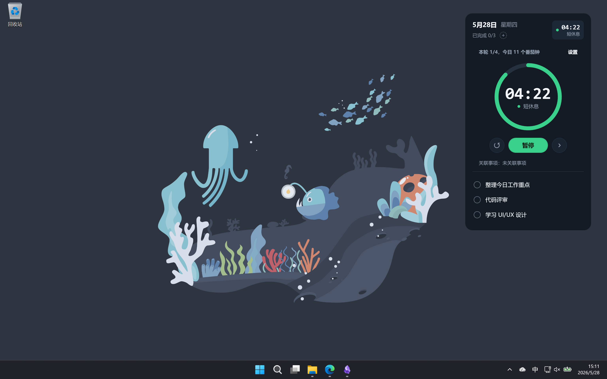

# Rhythm

<p align="center">
  
</p>

[](https://opensource.org/licenses/MIT)

Rhythm 是一个轻量的 Windows 桌面清单与番茄钟工具。它适合放在屏幕角落，帮你记住今天要反复完成的小事项，同时用番茄钟把注意力稳稳拉回当前任务。



## 你可以用它做什么

- 把每日例行动作放在桌面上，例如运动、读书、复盘、整理工作重点。
- 临时加入只做一次的事项，完成后跨到第二天自动移除。
- 在清单旁边开启番茄钟，按专注、短休息、长休息循环推进。
- 把番茄钟关联到某个事项，让当前专注目标更清楚。
- 关闭窗口时隐藏到托盘，需要时再从托盘唤回。
- 开启开机启动，让它每天自动出现在你的工作环境里。

## 设计取向

Rhythm 不是复杂的项目管理软件。它更像一张常驻在桌面上的小纸条：

- 不需要账号。
- 不联网。
- 不上传任何清单或使用记录。
- 不打断你的工作流。
- 不进入任务栏或 Alt-Tab。
- 默认固定在桌面底层，适合长期放在屏幕边缘。

## 运行环境

- Windows 10 / 11 x64
- 使用发布版时无需预装 .NET Runtime
- 开发环境需要 Windows 与 .NET 10 SDK

发布版目标是 `win-x64` self-contained 单文件应用，入口位于：

```powershell
.\publish\Rhythm.exe
```

## 快速开始

1. 双击 `publish/Rhythm.exe` 启动 Rhythm。
2. 首次启动会自动创建本地状态文件，并预置 3 个示例事项：
   - 早起冥想 5 分钟
   - 运动 20 分钟
   - 读书 30 分钟
3. 右键托盘图标，选择“编辑事项...”替换成自己的清单。
4. 在主窗口顶部点击番茄钟状态条，可展开完整番茄钟面板。
5. 如果希望每天自动启动，在托盘菜单勾选“开机启动”。

关闭窗口按钮只会把 Rhythm 隐藏到托盘；真正退出请使用托盘菜单里的“退出”。

## 日常操作

| 操作 | 说明 |
|---|---|
| 勾选每日事项 | 今天标记为完成，本地午夜后自动重置 |
| 新增一次性事项 | 适合临时任务；完成后跨到第二天自动移除 |
| 拖动窗口 | 保存窗口位置；屏幕变化导致越界时会回到默认位置 |
| 展开番茄钟 | 查看当前阶段、剩余时间、轮次和关联事项 |
| 暂停 / 继续 | 保留当前番茄钟进度 |
| 跳过阶段 | 直接进入下一段专注或休息 |
| 重置番茄钟 | 回到空闲状态，等待重新开始 |
| 托盘双击 | 显示主窗口 |
| 托盘右键菜单 | 显示、隐藏、编辑、透明效果、开机启动、关于、退出 |

## 本地数据

Rhythm 的清单、窗口位置、透明效果和番茄钟状态只保存在本机：

```text
%APPDATA%\Rhythm\state.json
```

状态文件主要包含：

- `schemaVersion`
- `items[]`
- `completedToday[]`
- `lastResetDate`
- `windowPos`
- `enableTransparency`
- `pomodoroConfig`
- `pomodoroSession`

如果状态文件缺失或 JSON 损坏，应用会回退到默认状态。保存时使用临时文件替换，降低半写入导致下次启动失败的风险。

## 隐私与安全

- 应用本地运行，不需要账号。
- 应用不做网络请求。
- 应用不上传遥测、清单内容或使用记录。
- 开机启动只写入当前用户的 `HKCU\Software\Microsoft\Windows\CurrentVersion\Run`。
- 安全问题报告方式见 [`SECURITY.md`](SECURITY.md)。

## 卸载

1. 如果启用过开机启动，先在托盘菜单取消勾选“开机启动”。
2. 在托盘菜单选择“退出”。
3. 删除发布目录中的 `Rhythm.exe`。
4. 如需删除所有本地数据，删除 `%APPDATA%\Rhythm\`。

## 开发

解决方案文件是 `Rhythm.slnx`，WPF 应用项目是 `src/Rhythm/Rhythm.csproj`，测试项目是 `tests/Rhythm.Tests/Rhythm.Tests.csproj`。

```powershell
# Debug 构建
dotnet build Rhythm.slnx -c Debug

# Debug 运行
dotnet run --project src/Rhythm/Rhythm.csproj -c Debug

# Release 构建
dotnet build Rhythm.slnx -c Release

# 单元测试
dotnet test Rhythm.slnx -c Release
```

发布 win-x64 self-contained 单文件 exe 到 `publish/`：

```powershell
dotnet publish src/Rhythm/Rhythm.csproj `
  -c Release `
  -r win-x64 `
  -p:PublishSingleFile=true `
  -p:SelfContained=true `
  -p:IncludeNativeLibrariesForSelfExtract=true `
  -o publish
```

发布后运行：

```powershell
.\publish\Rhythm.exe
```

## 项目结构

| 模块 | 职责 | 关键文件 |
|---|---|---|
| 应用启动与托盘 | 初始化状态、创建主窗口、构建托盘菜单、安排午夜重置 | `src/Rhythm/App.xaml.cs` |
| 清单状态 | 每日重置、一次性事项跨日移除、勾选、增删改移等纯 C# 逻辑 | `src/Rhythm/State/RhythmState.cs` |
| 状态结构 | `state.json` 的 schema 与记录类型 | `src/Rhythm/State/StateSchema.cs` |
| 持久化 | System.Text.Json 读写，损坏回退默认，保存使用 temp + replace | `src/Rhythm/State/StateStore.cs` |
| 番茄钟 | 专注 / 休息阶段推进、暂停、继续、跳过、重置和配置应用 | `src/Rhythm/State/PomodoroStateMachine.cs`、`src/Rhythm/UI/PomodoroViewModel.cs` |
| 本地路径 | `%APPDATA%\Rhythm\state.json` 等本地路径 | `src/Rhythm/AppPaths.cs` |
| Win32 互操作 | 桌面底层固定、工具窗口样式、窗口位置约束 | `src/Rhythm/Interop/Win32.cs` |
| 自启动 | 读写当前用户 Run 注册表项 | `src/Rhythm/Autostart/AutostartManager.cs` |
| ViewModel | UI 状态投影、命令封装、窗口数据绑定 | `src/Rhythm/UI/` |
| 视图 | 主窗口、编辑窗口、关于窗口和主题资源 | `src/Rhythm/*.xaml`、`src/Rhythm/Themes/Dark.xaml` |
| 测试 | 状态机与持久化的 xUnit 覆盖 | `tests/Rhythm.Tests/` |
